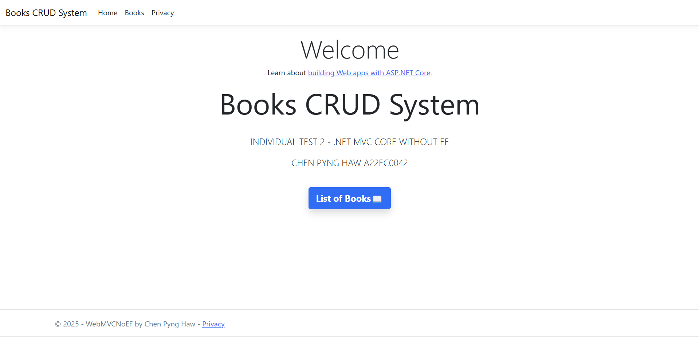
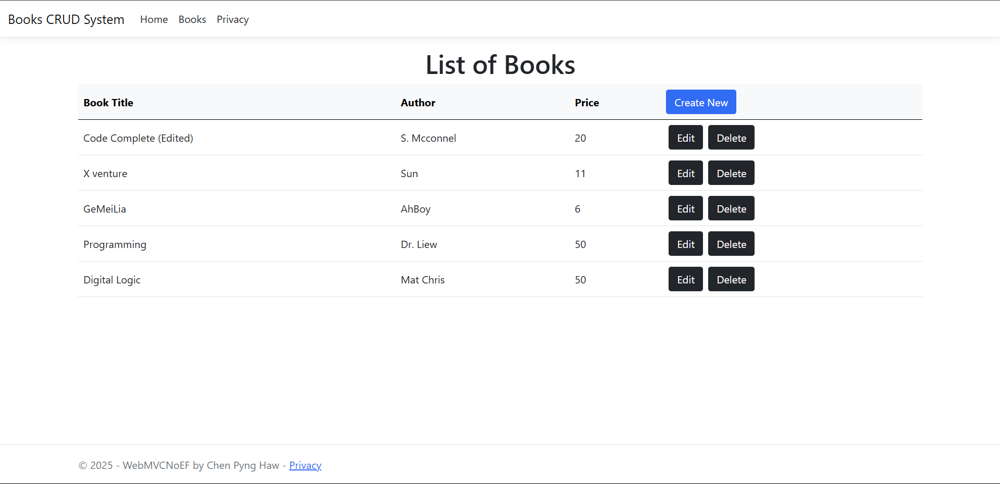

# Book-Management-System
This is a simple Book Management System built with ASP.NET Core MVC, demonstrating how to perform full CRUD operations without Entity Framework.

## Features
✅ View all books  
✅ Add new book records  
✅ Edit existing book details  
✅ Delete books  
✅ Stored procedures for database operations  
✅ Clean UI using Bootstrap  

## Technologies Used
- ASP.NET Core MVC
- ADO.NET (SqlConnection, SqlCommand)
- SQL Server (with stored procedures)
- Bootstrap 5
- Visual Studio 2022

## Page View

#### Home Page (After Login)

#### List of Books Page

#### Edit, Update and Delete Book Page

